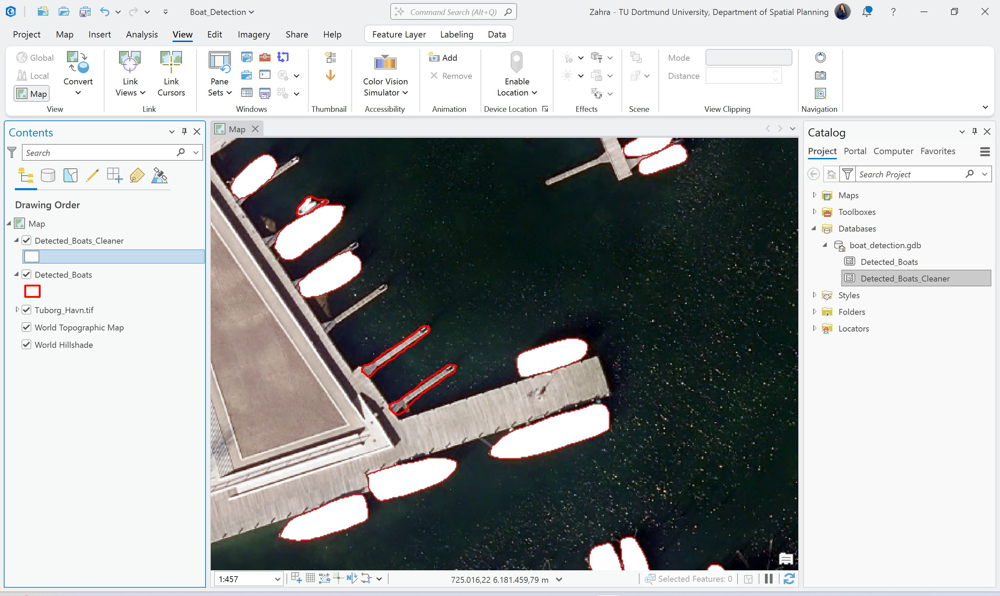

# GIS & GeoAI Portfolio

Sophia (Zahra) Chehreghan

Projects completed using ArcGIS Pro and GeoAI workflows.

---

## Projects

### 1. Detect Objects with TextSAM
Deep learning object detection applied to aerial imagery.

### 2. Detect Objects with a Pretrained Model
Object detection using pretrained deep learning models.

### 3. Improve a Deep Learning Model with Transfer Learning
Training and fine-tuning a model for building footprint detection.

### 4. Extract High-Resolution Land Cover with GeoAI
Semantic segmentation of high-resolution imagery.

### 5. Identify Infrastructure at Risk of Landslides
Spatial analysis combining terrain and infrastructure data.

## Project 1 — Boat Detection with TextSAM

This project demonstrates object detection in high-resolution aerial imagery using the TextSAM deep learning model in ArcGIS Pro.

### Input imagery

### Initial boat detection

### Refined detection result

**Tools used**

- ArcGIS Pro
- Deep Learning toolbox
- TextSAM model
- Image analysis
- Vector feature extraction
